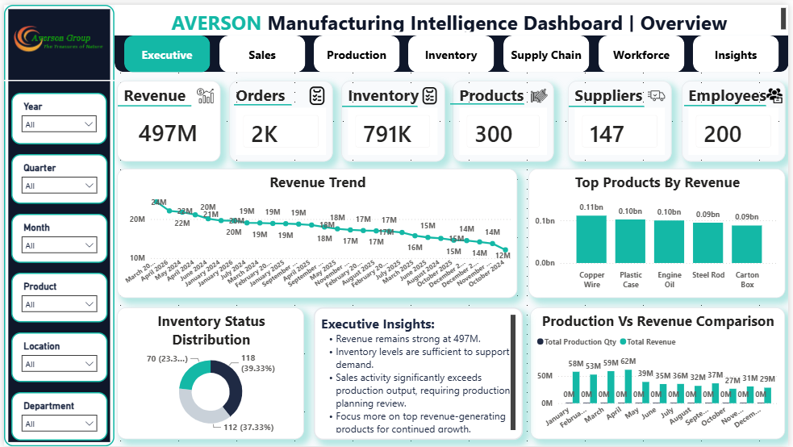
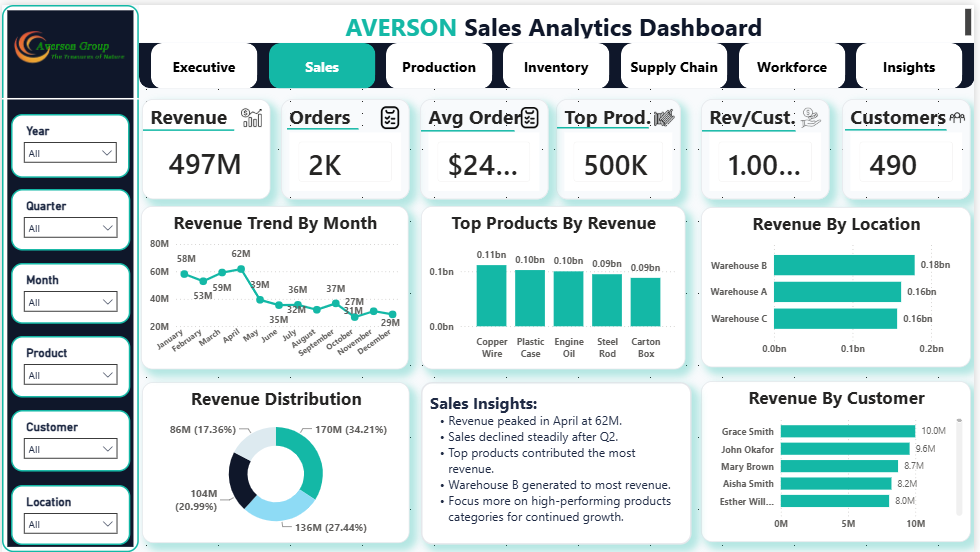
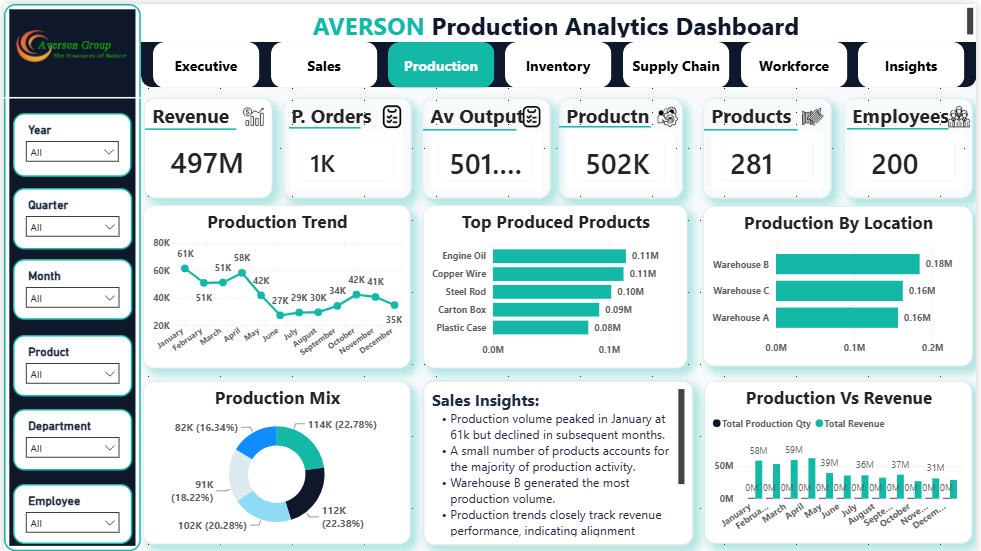
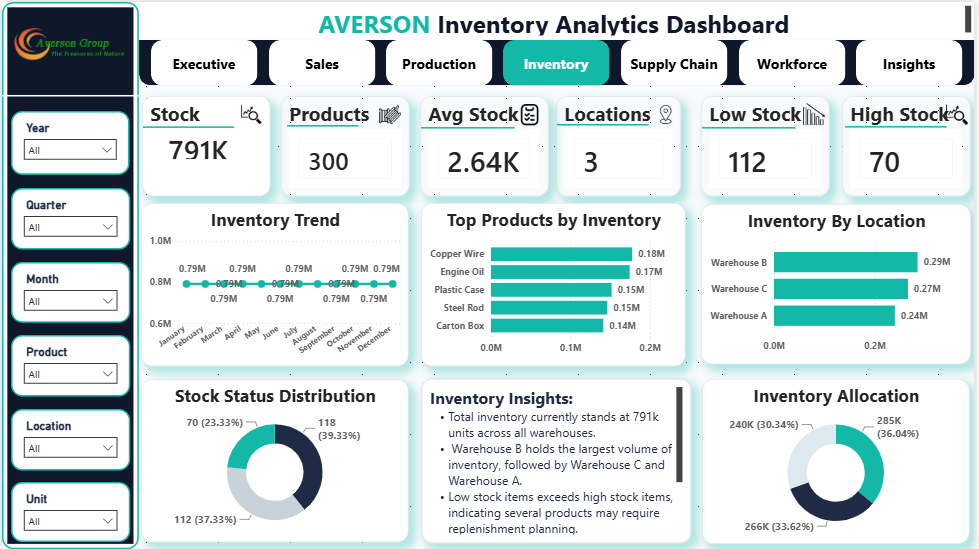
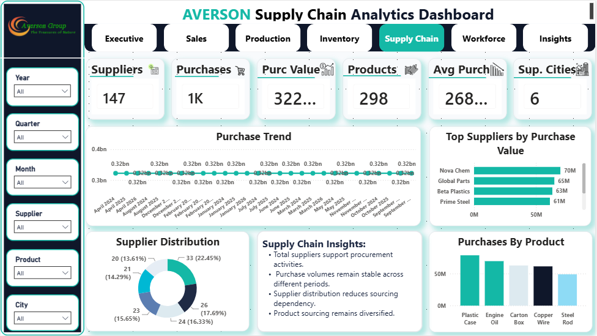
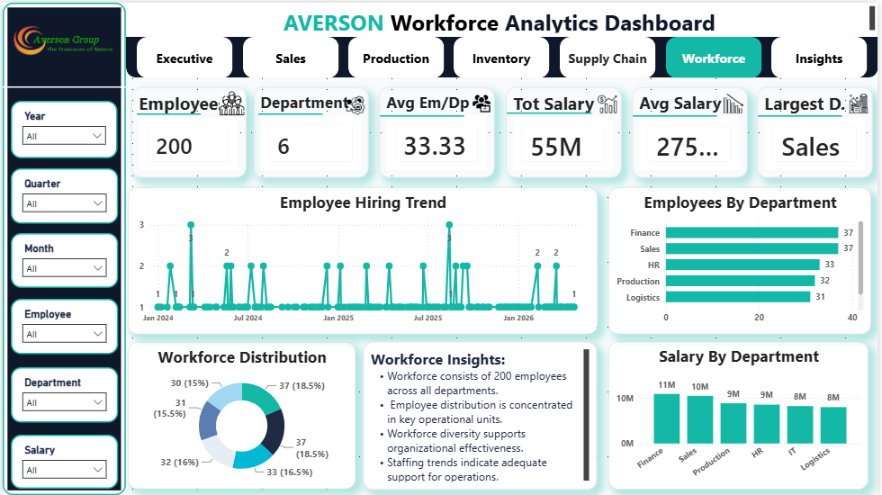
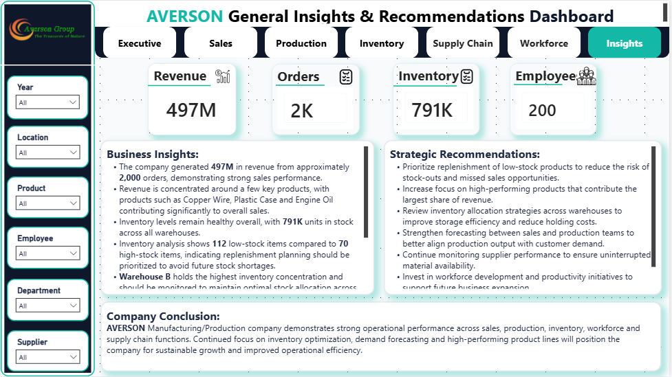

# 🏭 Averson Manufacturing Intelligence Analytics

## 📌 Project Overview

This project presents a comprehensive Business Intelligence solution developed for **Averson Manufacturing Company** using **Power BI**.

The objective was to analyze key business functions—including production, sales, inventory, supply chain, and workforce performance—to provide management with actionable insights for strategic decision-making.

---

## 🎯 Business Problem

Management required a centralized reporting solution to monitor operational performance and identify opportunities for improving efficiency across the organization.

The analysis focused on:

- Production Performance
- Sales Performance
- Inventory Management
- Supply Chain Operations
- Workforce Productivity

---

## 🎯 Project Objectives

- Monitor production performance.
- Analyze sales trends and revenue.
- Evaluate inventory levels.
- Assess supplier performance.
- Track workforce productivity.
- Deliver executive-level insights and recommendations.

---

## 🛠️ Tools & Technologies

- Power BI
- Power Query
- DAX
- Microsoft Excel

---

## 📂 Dataset

The project was built using manufacturing business data covering:

- Customers
- Suppliers
- Products
- Departments
- Employees
- Production Orders
- Inventory
- Sales
- Purchases
- Quality Control

---

## 📊 Dashboard Pages

1. Executive Overview
2. Sales Analysis
3. Production Analysis
4. Inventory Analysis
5. Supply Chain Analysis
6. Workforce Analysis
7. Business Insights & Strategic Recommendations

---

## 📈 Key Performance Indicators (KPIs)

- Revenue
- Orders
- Inventory
- Products
- Suppliers
- Employees
- Production Output

---

## 💡 Business Value

This dashboard enables management to:

- Monitor manufacturing performance.
- Identify inventory trends.
- Track production efficiency.
- Evaluate workforce productivity.
- Support data-driven operational decisions.

---

## 📷 Dashboard Preview

### 📊 Executive Overview

---

### 💰 Sales Analysis

---

### 🏭 Production Analysis

---

### 📦 Inventory Analysis

---

### 🚚 Supply Chain Analysis

---

### 👥 Workforce Analysis

---

### 💡 Business Insights & Strategic Recommendations

---

## 🚀 Future Improvements

Future versions may include:

- Predictive forecasting
- Demand forecasting
- Machine performance analysis
- Real-time reporting

---

## 💼 Skills Demonstrated

- Data Cleaning
- Data Modeling
- Power Query
- DAX Calculations
- KPI Development
- Dashboard Design
- Business Analysis
- Data Visualization
- Executive Reporting
- Data Storytelling

---

## 📌 Key Takeaways

This project demonstrates my ability to transform manufacturing data into meaningful business insights through interactive dashboards and executive reporting. It highlights my skills in data preparation, KPI development, visualization design, and communicating recommendations that support strategic decision-making.

---

## 👩🏽‍💻 Author

**Adaku Bridget Nwaolisa**

Aspiring Data Analyst passionate about transforming data into actionable business insights.
